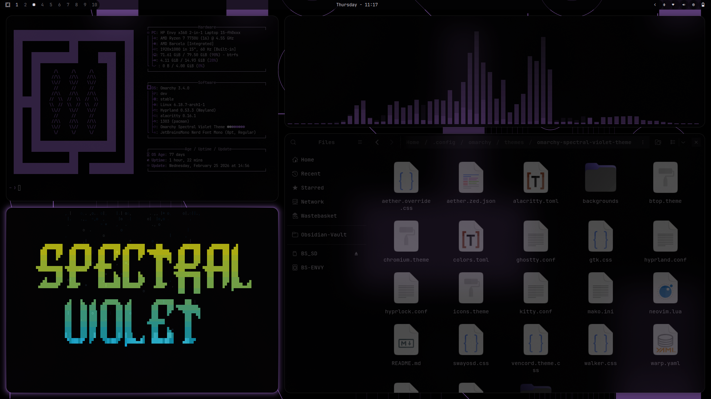

# Omarchy Spectral Violet Theme 🌌

A deep, ethereal violet theme for the Omarchy ecosystem. Inspired by post-spectralist aesthetics and the natural harmonic series, this theme balances dark, obsidian backgrounds with vibrant, lavender-to-purple accents.

Designed with high-contrast typography and a flowy aesthetic, **Spectral Violet** is built for focus, clarity, and a touch of mathematical precision.



## 🎨 The Palette

- **Background:** `#040305` (Deep Obsidian)
- **Foreground:** `#d9d3de` (Soft Lavender Grey)
- **Accent:** `#9357ce` (Spectral Violet)
- **Active Border:** `#a765e9` (Bright Amethyst)

## ✨ Visual Characteristics

- **Opacity:** A signature semi-transparent look with **86% active window opacity** and **43% inactive opacity**, creating a layered, "ghostly" depth.
- **Blur:** Multi-pass Gaussian blur on background surfaces for a frosted-glass effect.
- **Animations:** Smooth, custom bezier curves (`0, 0.2, 0.8, 1`) with slide-fade transitions.
- **Rounded Corners:** Border radii are set to 16 for a clean, flowy feel.

## 📦 Supported Applications

This theme includes configurations for a wide range of tools:

- **Window Manager:** Hyprland (`hyprland.conf`, `hyprlock.conf`)
- **Terminals:** Alacritty, Ghostty, Kitty, Warp
- **Editors:** Neovim (Lua), Zed
- **Shell & UI:** Waybar, Mako (Notifications), SwayOSD, Walker, Wofi
- **Browsers & Chat:** Chromium, Vencord (Discord)
- **System Tools:** Btop
- **Toolkit:** GTK4/Adwaita (via `aether.override.css`)

## 🖼️ Backgrounds

The theme comes with a curated set of 6 spectral backgrounds:
1. `PurpleMoon.png`
2. `PerlinFlowfield.png`
3. `RadialBlur.png`
4. `RecursiveGeometry.png`
5. `TopographyDots.png`
6. `HypercubeCircles.png`

## 🚀 Installation

This theme can be tuned into your Omarchy system in two ways.

### 💻 Terminal
Run the following command to clone and activate the theme:
```bash
omarchy-theme-install https://github.com/shmall03/omarchy-spectral-violet-theme.git
```

### 🧭 Walker Menu
1. **Copy** this link: `https://github.com/shmall03/omarchy-spectral-violet-theme.git`
2. **Open Walker** (`SUPER+ALT+SPACE`)
3. **Navigate** to: `Install < Style < Theme`
4. **Paste** (`CTRL+SHIFT+V`) and press **Enter**.

## 🎹 Inspiration
The name **Spectral Violet** refers to the post-spectralist movement in music — focusing on the properties of sound itself and the harmonic series. Much like a complex chord being broken down into its constituent frequencies, this theme breaks down the violet spectrum into a functional, cohesive workspace.

## 🙏 Acknowledgements

Special thanks to **[@bjarneo](https://github.com/bjarneo)** for creating the incredible **Aether** tool, which made the initial creation of this theme possible.

---
Created with <3 by shmall.
